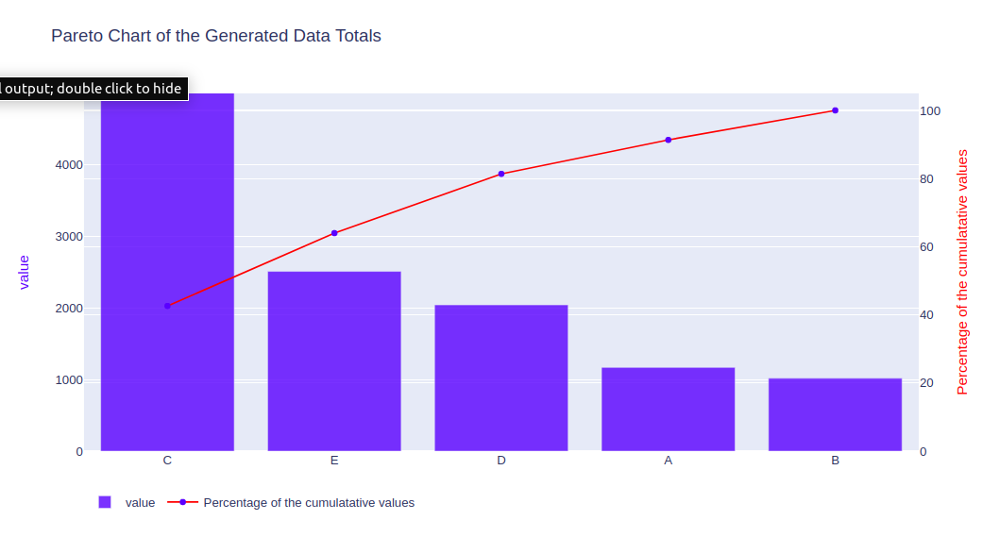
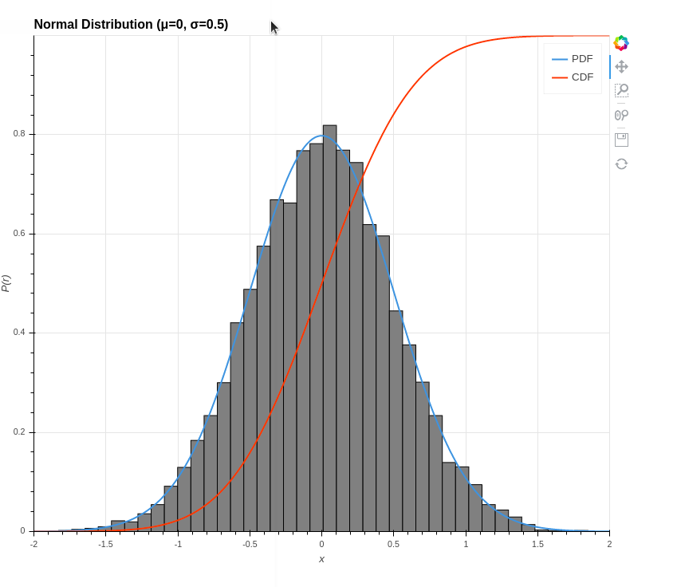

# [Pareto-Chart 2020](https://github.com/datasciencesociety/Pareto-Chart) 
Generated several series A, B, C, D and E using random generator for normal, exponential, uniform and poisson distributions. Summing up the values and visualizing the results using Matplotlib and Plotly. Alternatively the notebook can be viewed at Kaggle [Kaggle-link](https://www.kaggle.com/stephen924/pareto-chart)

  

# [Exploring-Bike-Rides-in-NYC 2020](https://github.com/datasciencesociety/Exploring-Bike-Rides-in-NYC/tree/master) 
This study was conducted on the first monthly data for bikes trips in New York City in 2018. Another dataset for the weather at that period was used. 
Several visualizations and geographic maps have been used. Also hypothesis testing has been performed. Here are some of the conclusion:
* The correlations between the predictors and the dependent variable (the trip duration) are weak.
* The study was left with some questions about the majority of the geographical coordinates for being in the ocean and not on land even though bikes are a terrestrial means of transport. This should be investigated further.
* The number and length of trips has increased during this month (although this is a very short period to draw any generalizations). There seems to be declines in the weekends and possibly some holidays like New Year.
* Older people tend to have longer trip durations.
* Most of the people are subscribers, although the customers have a longer trip duration on average.

  

# [Interactive Probability Visualizations 2019](https://github.com/datasciencesociety/Probability_Visualization)
There is short description of each of the probability distributions Thiss includes both discrete and continuous probability distributions. Some of the feature are. Holoviews is used to make the visualizations. The visualizations are plots of histograms, pdf (probability density function) or pmf (probability mass function) for the discrete and cdf (cumulative density functions). Sliders are added as widgets to change the parameters. 
Alternative links for the code with visualizations can be viewed at Kaggle:
* [Discrete](https://www.kaggle.com/stephen924/discrete-probability-distributions-part-1)
* [2A](https://www.kaggle.com/stephen924/continuous-distributions-part-2a)
* [2B](https://www.kaggle.com/stephen924/continuous-distributions-part-2b)
* [2C](https://www.kaggle.com/stephen924/continuous-distributions-part-2c)
* [2D](https://www.kggle.com/stephen924/continuous-distributions-part-2d)
* [2E](https://www.kaggle.com/stephen924/continuous-distributions-part-2e)

  

