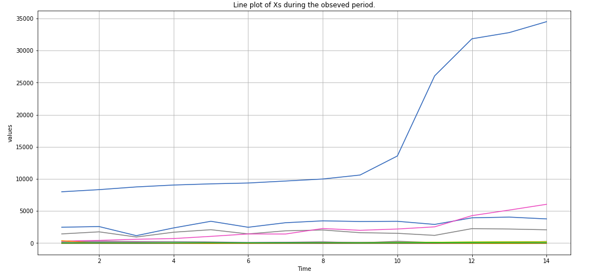
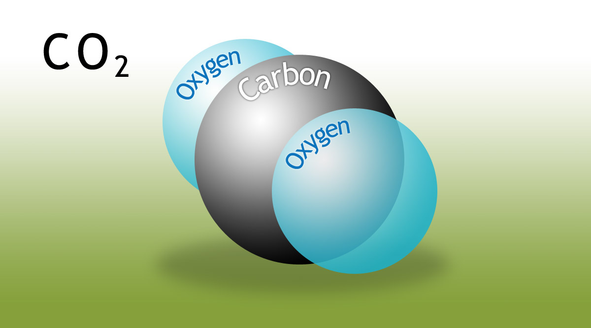

# [Data Science Portfolio]

# [Pareto-Chart 2020](https://github.com/datasciencesociety/Pareto-Chart) 
Generated several series A, B, C, D and E using random generator for normal, exponential, uniform and poisson distributions. Summing up the values and visualizing the results using Matplotlib and Plotly. Alternatively the notebook can be viewed at Kaggle [Kaggle-link](https://www.kaggle.com/stephen924/pareto-chart)

  

# [Summer-School-Research-Methods 2020](https://github.com/Marchev-Science/Summer-school-on-research-methods-2020/blob/master/case2/Financial%20Distress%20with%20Sklearn%20Division%20into%20categories%20of%20the%20target%20variable%20Part%203.ipynb) 
This is my project as a participant in the Summer School of Research Methods organized by the FEBA (Faculty of Economics and Business Administration) at Sofia University. The second case was picked by the team. The financial distress data of companies was used. This is part of a Kaggle dataset which can be viewed in the following link: [dataset](https://www.kaggle.com/shebrahimi/financial-distress). Part 1 and Part 2 of the case was done by another teammate. The task is to explore the data and try different modeling techniques to explain the reasons for financial distress of different companies. Python and sklearn was used. No solid findings were found. There is a need of trying other methods. Later there is part 4 of the case where PyCaret or another low code machine learning library was used. The findings show that the library has significant discrepancies compared to sklearn which is a well-known mature library. The notebook can be viewed here: [PyCaret-Notebook](https://github.com/Marchev-Science/Summer-school-on-research-methods-2020/blob/master/case2/Financial%20Distress%20Division%20with%20PyCaret%20Part%204.ipynb)

  

# [Exploring-Bike-Rides-in-NYC 2020](https://github.com/datasciencesociety/Exploring-Bike-Rides-in-NYC/tree/master) 
This study was conducted on the first monthly data for bikes trips in New York City in 2018. Another dataset for the weather at that period was used. 
Several visualizations and geographic maps have been used. Also hypothesis testing has been performed. Here are some of the conclusion:
* The correlations between the predictors and the dependent variable (the trip duration) are weak.
* The study was left with some questions about the majority of the geographical coordinates for being in the ocean and not on land even though bikes are a terrestrial means of transport. This should be investigated further.
* The number and length of trips has increased during this month (although this is a very short period to draw any generalizations). There seems to be declines in the weekends and possibly some holidays like New Year.
* Older people tend to have longer trip durations.
* Most of the people are subscribers, although the customers have a longer trip duration on average.

  

# [Interactive Probability Visualizations 2019](https://github.com/datasciencesociety/Probability_Visualization)
There is short description of each of the probability distributions Thiss includes both discrete and continuous probability distributions. Some of the feature are. Holoviews is used to make the visualizations. The visualizations are plots of histograms, pdf (probability density function) or pmf (probability mass function) for the discrete and cdf (cumulative density functions). Sliders are added as widgets to change the parameters. 
Alternative links for the code with visualizations can be viewed at Kaggle:
* [Discrete](https://www.kaggle.com/stephen924/discrete-probability-distributions-part-1)
* [2A](https://www.kaggle.com/stephen924/continuous-distributions-part-2a)
* [2B](https://www.kaggle.com/stephen924/continuous-distributions-part-2b)
* [2C](https://www.kaggle.com/stephen924/continuous-distributions-part-2c)
* [2D](https://www.kggle.com/stephen924/continuous-distributions-part-2d)
* [2E](https://www.kaggle.com/stephen924/continuous-distributions-part-2e)

  

# [Relationships Between Penstions and Health Status 2019](https://github.com/datasciencesociety/Relationships_between_penstions_and_health_status/blob/main/Finding-Relationships-between-Pensions-Health-Status-and-Education-in-B....ipynb)
This aim of this project is to find any meaningful relationships between the level of education, the health status and the financial status of a sample of a survey of pensioners in Bulgaria. The data is provided by the World bank. One way, two way ANOVA as well as kruskal–wallis statistical non parametric test have been used. All the test show that there is a positive relationship between the variables and the pension levels. More work is needed to determine the strength and way of the relationship.

  

# [CO2-Prediction 2018](https://github.com/datasciencesociety/CO2-Prediction)
The aim of this project is to predict monthly CO2 concentration in the atmosphere in ppm (particles per million). Several architectures of rnn (recurrent neural network) have been used. 3 types of networks have been displayed in 3 notebooks LSTM, GRU and stacked LSTM. The LSTM offers the closest predictions. This measures the concentration of CO2 in the atmosphere on a monthly basis from 1958 to present day. This is the greenhouse gas with the highest concentration that accounts for more then 80% of climate change. Other notable gases are methane, ozone, water vapour and nitrogen oxides, but even though they have a far larger warming potential, they have a significantly lower concentration in ppb (particles per billion) while CO2 is measured in ppm or particles per million., For more information on the subject check this link: [keeling curve](https://scripps.ucsd.edu/programs/keelingcurve/)

  

